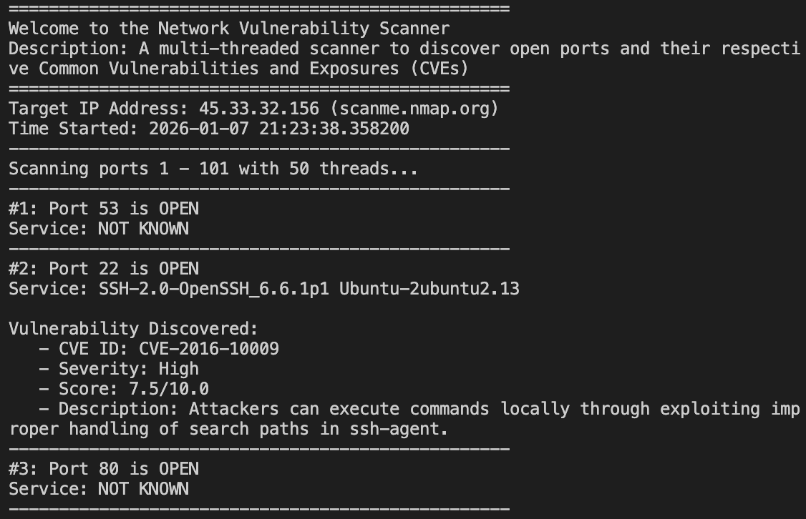

# Network Vulnerability Scanner

### 🛠️ Key Skills Demonstrated

## 📖 Description:
A multi threaded network scanner coded in Python. It scans for open ports, then finds running services by attempting to grab a banner and finally, cross checks with the local Common Vulnerability and Exposure (CVE) database based on the official NIST CVE database.

## 📂 Project Structure:
* `scanner.py`: This handles all main functions of the server including socket connections, thread management and the user interface.
* `CVE_db.py`: The CVE local database used for this project. Specific service banners are mapped to their CVE id, severity, score and description. Feel free to add more.

## ⚡ How to Run
1. Clone the repo.
2. Run 'python3 scanner.py' on your local device.

## ⚙️ How It Works
* **Part 1:** Using the socket library initiate a TCP connection by attempting a 3 way handshake to see if a port is open or not. 
* **Part 2:** Attempt to grab banner to find the specific software running on the open port.
* **Part 3:** Grabbed banner is cross referenced with the local CVE database.
* **Part 4:** Threads are concurrently spawned to scan the entire target range.

## 🧠 Learning Points
* **Two sides of CVEs**: I discovered the public NIST database and it made me think how it could be used for both bad and good. Defenders use it to patch systems but attackers can use this information to map attack surfaces.
* **TCP Handshake**: Seeing the abstract concept of the TCP handshake work via my own code was fascinating. It turned a theoretical diagram into a practical tool that sends SYN packets to find potential holes in a network.
* **Banners**: I learned that many services immediately announce their identity via banners upon connection. It was interesting to see that while many services do this others are configured to stay silent to improve security.
* **Threading**: I learnt about threading in university but implementing it in my scanner made me understand how it could be applied in real life. Applying theory to a real security tool helped me learn faster than just reading about it. 

## ⚠️ Disclaimer
This project is only for educational use that I created for authorised security testing and portfolio demonstration. It is ILLEGAL to scan networks without explicit permission so please be careful. I do not take responsibility for misuse. 

## 📸 Scanner Demonstration

  

