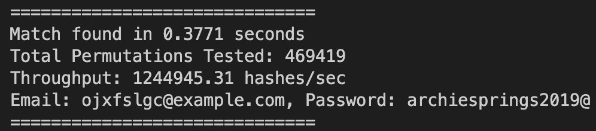

# Social Engineering Reconnaissance Tool

### 🛠️ Key Skills Demonstrated

## 📖 Description:
Created a Python utility to automate targeted reconnaissance by generating all possible permutations of OSINT-extracted keywords to identify compromised credentials within a large dataset.

## 📂 Project Structure:
* `script.py`: Main program that handles dataset loading, keyword processing, permutation generation and hash verification.
* `email_md5_dataset.txt`: Dataset containing email and MD5 hash pairs used for credential matching.
* `keywords.txt`: OSINT-style keywords used to generate potential password combinations.
* `*.cnf`: Configuration files defining certificate or security-related parameters if included.

## ⚡ How to Run
1. Clone the repo.
2. Ensure dataset and keywords files are in the same directory.
3. Run `python3 script.py`.

## ⚙️ How It Works
* **Part 1:** Given a set of OSINT-derived keywords, the program generates all possible permutations of keyword combinations to form potential passwords. 
* **Part 2:**  For each generated password candidate, the program computes its MD5 hash and checks whether the hash exists in the provided dataset file containing email and MD5 hash pairs.
* **Part 3:** If a hash match is found, the program prints the corresponding email address along with the recovered plaintext password.

## 🧠 Learning Points
* **OSINT:** I learnt how publicly available personal information can unintentionally help construct realistic password guessing strategies.
* **Hashing Verfication:** Implementing MD5 verification helped me understand how password storage and comparison mechanisms work in real systems.
* **Algorithmic Optimisation:** I learned how limiting unnecessary combinations and removing duplicates makes password testing much more efficient.

## 📸 Output

  

